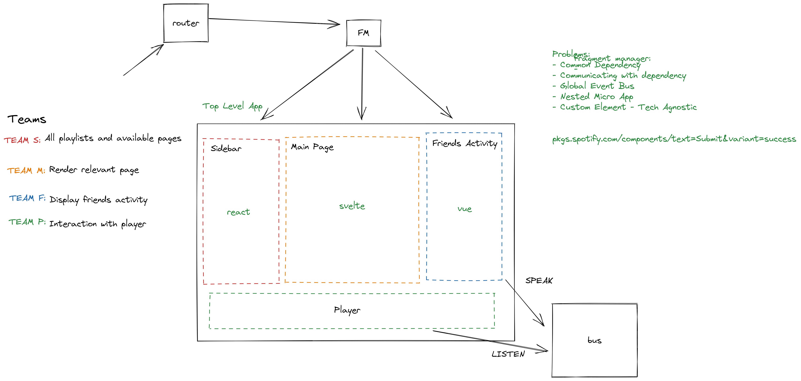

# Rinzler
Rinzler is an example implementation of microservice frontend architecture via using single-spa framework. The aim is release a project is similar to spotify. Each individual app uses different tech stack to expose the component. 

There is no attempt to produce a production ready project. It's just a experimental project and see how it works. But anyway we have still some issues about implementing the mfa.

*Micro-frontend architecture is a strategy in which the traditionally monolithic frontend codebase is split into smaller apps, ideally addressing the various business domains. All these smaller elements form a seamless frontend interface that delivers top-notch user experience and is easy to modify and scale.*

## General Info

there are three kinds of microfrontends in single-spa framework. The list is following:
1. single-spa applications: Microfrontends that render components for a set of specific routes.
2. single-spa parcels: Microfrontends that render components without controlling routes.
3. utility modules: Microfrontends that export shared JavaScript logic without rendering components.

root-config(single-spa) 5000

Microfrontends:
- sidebar(react) 5001
- main(svelte) 5002
- friends list(vue) 5003
- player(svelte) 5004

## Draft


## Requirements
- Docker

## Getting Started
root-config is running on 5000!

```
docker-compose up -d
```

## Notes
- Allowed all origins due to cors issues


## Resoures
- [https://single-spa.js.org/docs/microfrontends-concept](https://single-spa.js.org/docs/microfrontends-concept)
- [https://twitter.com/joelbdenning](https://twitter.com/joelbdenning)”
- [https://single-spa.js.org/docs/separating-applications/](https://single-spa.js.org/docs/separating-applications/)
- [https://single-spa.js.org/docs/recommended-setup/#shared-dependencies](https://single-spa.js.org/docs/recommended-setup/#shared-dependencies)
- [https://blog.playmoweb.com/speed-up-your-builds-with-docker-cache/](https://blog.playmoweb.com/speed-up-your-builds-with-docker-cache/)
- [https://micro-frontends.org/](https://micro-frontends.org/)
- [https://martinfowler.com/articles/micro-frontends.html](https://martinfowler.com/articles/micro-frontends.html)
- [https://levelup.gitconnected.com/micro-frontend-architecture-794442e9b325](https://levelup.gitconnected.com/micro-frontend-architecture-794442e9b325)